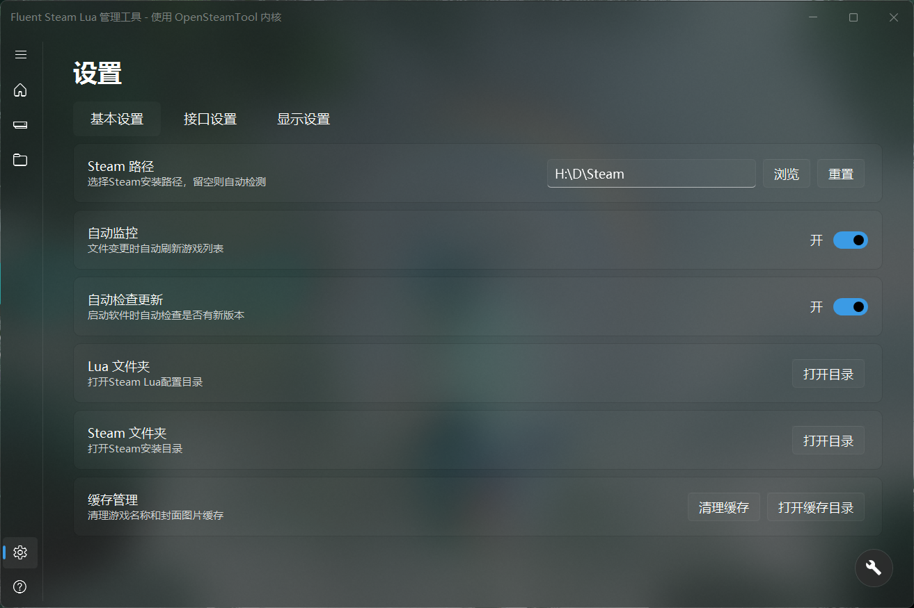
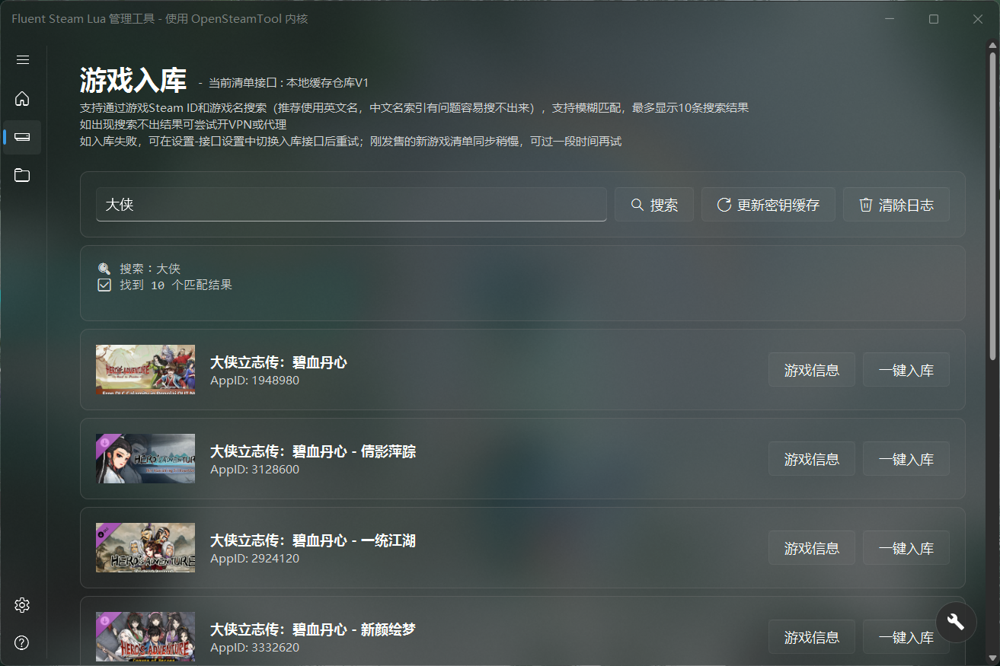

# Fluent Steam Lua 管理工具

基于 WPF + Fluent Design 开发的现代化轻量级 Steam Lua 入库管理工具，目前仅适配OpenSteamTool

## 预览

| 主页 | 设置页 | 入库页 |
|------|--------|--------|
|  |  |  |

## 功能特性

- 自动/手动扫描 Steam Lua 文件并匹配显示对应游戏名和封面
- 一键搜索预览并入库新游戏 支持 AppId / 游戏名 模糊搜索
- 一键查询当前游戏清单的DLC入库情况
- 一键下载游戏对应的修改器并管理
- 快速禁用或启用已入库游戏的状态，无需删除Lua清单，支持筛选显示
- 从 Steam 直接提取指定游戏 Lua 清单（需拥有正版游戏）
- 快捷管理 OpenSteamTool 更新、安装与卸载
- 游戏版本锁定：支持固定游戏清单版本到最新版本或当前已安装版本
- Steam账号快速切换登录
- 文件变更自动监控并刷新缓存（FileSystemWatcher）
- Fluent Design 现代化界面（Acrylic 亚克力 / NavigationView / 圆角过渡）


## 系统要求

- Windows 10 1809+ / Windows 11
- [.NET 8 Runtime](https://dotnet.microsoft.com/download/dotnet/8.0)

## 构建方法

发布为单文件可执行程序：

```bash
dotnet publish -c Release -r win-x64 --no-self-contained -p:PublishSingleFile=true -p:IncludeNativeLibrariesForSelfExtract=true -p:DebugType=none
```

发布为散文件可执行程序：

```bash
dotnet publish -c Release -r win-x64
```
